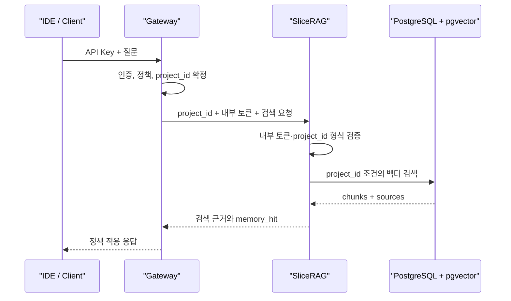

# SliceRAG

**Gateway가 인증한 프로젝트 범위 안에서만 문서를 저장·검색하는 내부 RAG 메모리 서비스**입니다.

SliceRAG는 범용 챗봇이나 외부 공개 API가 아닙니다. 외부 API Key 인증, 사용자 권한, 감사 정책은 Gateway가 맡고, SliceRAG는 `project_id`별 문서 namespace와 검색 근거를 일관되게 관리합니다.

## 왜 SliceRAG인가

하나의 RAG 저장소를 여러 프로젝트가 공유할 때 중요한 것은 검색 품질만이 아닙니다. 다른 프로젝트의 문서가 검색 결과에 섞이지 않는 **스코프 불변식**이 먼저 보장되어야 합니다.

SliceRAG는 다음을 명시적으로 보장합니다.

- 모든 ingest, search, document 조회는 하나의 `project_id` 안에서만 수행합니다.
- `all` 같은 교차 프로젝트 예약 식별자를 허용하지 않습니다.
- 프로젝트 목록을 열거하거나 브라우저에서 직접 검색하는 API를 제공하지 않습니다.
- `/internal/*` 요청은 Gateway와 공유한 `X-SliceRAG-Internal-Token` 없이는 실행되지 않습니다.
- 검색 결과에 chunk와 source를 함께 반환하여 Gateway가 감사 메타데이터를 남길 수 있습니다.

## 아키텍처



## 구성

| 영역 | 구현 |
| --- | --- |
| API | FastAPI, 내부 전용 `/internal/*` 경로 |
| 저장소 | PostgreSQL + pgvector 또는 인메모리 테스트 저장소 |
| 검색 | 텍스트 청킹, 임베딩, cosine/vector similarity 검색 |
| 격리 | `project_id` namespace, 교차 프로젝트 조회 차단 |
| 운영 | Docker Compose, healthcheck, PostgreSQL migration |
| 모델 경계 | embedding 호출은 Gateway 정책을 경유하는 OpenAI 호환 endpoint로 연결 가능 |

## 빠른 시작

```bash
git clone https://github.com/devcy0922/slicerag.git
cd slicerag
cp .env.example .env
```

`.env`에서 `SLICERAG_INTERNAL_TOKEN`에 Gateway와 공유할 충분히 긴 무작위 값을 설정합니다. 실제 토큰과 고객 문서는 커밋하지 않습니다.

기본 `hash` embedding은 외부 모델 없이 API 계약과 격리를 확인할 때 사용합니다. 실제 embedding을 사용할 때는 `SLICERAG_EMBEDDING_PROVIDER=openai`와 Gateway의 OpenAI 호환 주소인 `SLICERAG_EMBEDDING_GATEWAY_URL`을 함께 설정합니다. SliceRAG가 외부 모델 provider를 직접 호출하는 구성은 지원하지 않습니다.

```bash
docker compose up --build
```

Compose는 `127.0.0.1`에만 포트를 바인딩합니다. 외부 클라이언트는 SliceRAG가 아니라 Gateway에 연결해야 합니다.

## 내부 API

모든 `/internal/*` 요청에는 아래 헤더가 필요합니다.

```http
X-SliceRAG-Internal-Token: <gateway와-공유한-토큰>
```

| Method | Path | 설명 |
| --- | --- | --- |
| `POST` | `/internal/projects/{project_id}/documents` | 문서 수집·청킹·저장 |
| `POST` | `/internal/projects/{project_id}/search` | 동일 프로젝트 namespace 내 검색 |
| `GET` | `/internal/projects/{project_id}/documents/{document_id}` | 동일 프로젝트 문서 메타데이터 조회 |
| `GET` | `/health` | 인증 없이 제공되는 liveness 확인 |

상세 요청·응답 계약은 [API 문서](docs/api.md), 데이터 모델은 [스키마 문서](docs/schema.md), Gateway 책임 분리는 [아키텍처 문서](docs/architecture.md)에서 확인할 수 있습니다.

## 검증 범위

테스트는 다음 보안 불변식을 다룹니다.

- 내부 토큰 누락 또는 불일치 요청 거부
- `alpha`에 저장한 문서를 `beta`에서 검색·조회할 수 없음
- `all`과 형식이 맞지 않는 프로젝트 식별자 거부
- 프로젝트 열거 및 브라우저용 루트 UI 비노출

```bash
make check
```

`make check`는 `ruff`, `mypy`, `pytest`를 순서대로 실행합니다. PostgreSQL + pgvector 운영 검증 절차는 [runbook](docs/postgres-runbook.md)을 참고하세요.

## 범위

포함:

- 프로젝트별 문서 ingest와 RAG 검색
- chunk/source 근거 반환
- 인메모리·PostgreSQL 저장소 전환
- 내부 서비스 인증과 프로젝트 스코프 검증

제외:

- 외부 사용자 인증과 권한 정책
- 웹 검색, 멀티에이전트 실행, 자동 코드 실행
- 외부 공개 UI와 프로젝트 목록 탐색

이 책임 분리는 SliceRAG를 작고 검증 가능한 RAG 컴포넌트로 유지하고, 인증·정책·감사는 Gateway에 집중시키기 위한 설계입니다.
