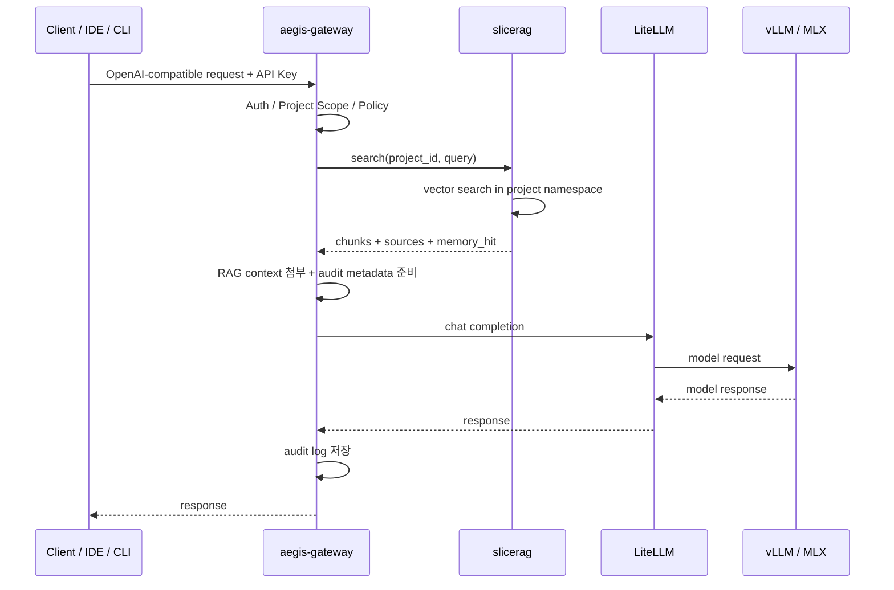

# Aegis Memory 아키텍처

## 설계 목표

Aegis Memory의 첫 목표는 **인증된 Project RAG**다.

같은 질문이라도 API Key가 가리키는 `project_id`에 따라 서로 다른 문서 네임스페이스를 검색해야 한다. 이 기능은 Gateway의 정책/감사 경계를 깨지 않고 제공되어야 한다.

## 요청 흐름



## 배치

| 항목 | 위치 | 이유 |
|---|---|---|
| `aegis-gateway` | macmini | 외부 진입점과 정책 집행 |
| `slicerag` | macmini | DB, 검색, ingest worker와 가까움 |
| PostgreSQL + pgvector | macmini | Gateway DB와 운영 일관성 |
| raw archive | NAS `/srv/nas/shared/slicerag/` | 원문 백업과 재처리 |
| vLLM | dgx-spark | 모델 서빙 전용 |
| MLX | M1 Max | 보조 모델 서빙 |

## 책임 분리

Gateway는 RAG 저장소를 직접 소유하지 않는다.

Memory는 인증과 정책 판단을 직접 수행하지 않는다.

Runtime은 MVP에 포함하지 않는다.

```text
Gateway = 진입점 / 인증 / 정책 / 감사
Memory = 프로젝트별 지식 검색
Runtime = 승인 기반 작업 실행, 이후 단계
```

## MVP 불변식

- 모든 외부 AI 요청은 Gateway를 통과한다.
- Memory API는 내부 서비스로만 노출한다.
- 모든 검색은 `project_id`로 범위가 제한된다.
- 검색 응답에는 sources를 포함한다.
- Gateway audit에는 `project_id`, `memory_hit`, `source_ids`가 남아야 한다.

## 현재 구현 단계

초기 구현은 다음 흐름을 실제 코드로 제공한다.

```text
document ingest
→ text chunk
→ deterministic hash embedding
→ in-memory project-scoped store
→ cosine search
→ chunks + sources 반환
```

이 단계의 목적은 API 계약과 `project_id` 격리를 검증하는 것이다. 영속 저장소와 실제 embedding 모델 호출은 다음 단계에서 PostgreSQL + pgvector 및 Gateway 경유 embedding provider로 교체한다.

## 저장소 모드

`SLICERAG_STORE`로 저장소 구현을 선택한다.

| 값 | 용도 |
|---|---|
| `memory` | 로컬 테스트와 API 계약 검증 |
| `postgres` | macmini 운영 후보, PostgreSQL + pgvector 사용 |

두 구현 모두 같은 내부 API와 response schema를 유지해야 한다.
