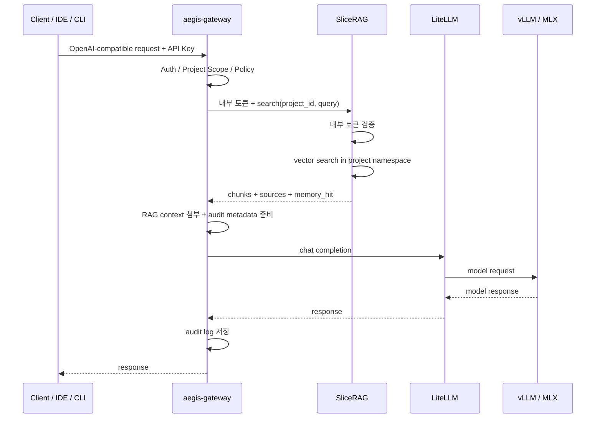

# SliceRAG 아키텍처

## 설계 목표

SliceRAG의 첫 목표는 **Gateway가 인증한 Project RAG**다.

같은 질문이라도 API Key가 가리키는 `project_id`에 따라 서로 다른 문서 네임스페이스를 검색해야 한다. 이 기능은 Gateway의 정책/감사 경계를 깨지 않고 제공되어야 한다.

## 요청 흐름



## 배치

| 항목 | 위치 | 이유 |
|---|---|---|
| `aegis-gateway` | Gateway 노드 | 외부 진입점과 정책 집행 |
| `slicerag` | 애플리케이션 노드 | DB, 검색, ingest worker와 가까움 |
| PostgreSQL + pgvector | 데이터 노드 | Gateway DB와 운영 일관성 |
| raw archive | 객체 스토리지 | 원문 백업과 재처리 |
| vLLM | GPU 추론 노드 | 모델 서빙 전용 |
| MLX | 보조 추론 노드 | 보조 모델 서빙 |

## 신뢰 경계와 책임 분리

Gateway는 RAG 저장소를 직접 소유하지 않는다.

SliceRAG는 외부 API Key 인증이나 사용자 권한 판단을 수행하지 않는다. 대신 Gateway만 호출할 수 있도록 내부 공유 토큰을 검증한다. 이는 외부 인증을 중복 구현하는 것이 아니라, 내부 API의 직접 호출을 차단하는 서비스 간 인증이다.

Runtime은 MVP에 포함하지 않는다.

```text
Gateway = 진입점 / 인증 / 정책 / 감사
Memory = 프로젝트별 지식 검색
Runtime = 승인 기반 작업 실행, 이후 단계
```

```text
외부 클라이언트 ── API Key ──> Gateway
Gateway ── project_id + X-SliceRAG-Internal-Token ──> SliceRAG
SliceRAG ── project_id 조건을 포함한 저장·검색 ──> PostgreSQL + pgvector
```

`project_id`는 Gateway가 외부 인증 결과에서 결정한다. SliceRAG는 `all` 같은 교차 프로젝트 예약 식별자를 허용하지 않으며, 프로젝트 목록을 반환하는 API도 제공하지 않는다.

## MVP 불변식

- 모든 외부 AI 요청은 Gateway를 통과한다.
- Memory API는 내부 서비스로만 노출하고, 내부 토큰 없이는 실행하지 않는다.
- 모든 검색은 `project_id`로 범위가 제한된다.
- ingest, search, document 조회 모두 같은 `project_id` 범위만 허용한다.
- 검색 응답에는 sources를 포함한다.
- Gateway audit에는 `project_id`, `memory_hit`, `source_ids`가 남아야 한다.

## 현재 구현 단계

현재 구현은 다음 흐름을 실제 코드로 제공한다.

```text
document ingest
→ text chunk
→ deterministic hash embedding
→ in-memory project-scoped store
→ cosine search
→ chunks + sources 반환
```

이 단계의 목적은 API 계약과 `project_id` 격리를 검증하는 것이다. PostgreSQL + pgvector 저장소는 제공하며, 실제 embedding 호출은 Gateway 정책을 경유하는 OpenAI 호환 endpoint로만 연결한다.

## 저장소 모드

`SLICERAG_STORE`로 저장소 구현을 선택한다.

| 값 | 용도 |
|---|---|
| `memory` | 로컬 테스트와 API 계약 검증 |
| `postgres` | 운영 환경 후보, PostgreSQL + pgvector 사용 |

두 구현 모두 같은 내부 API와 response schema를 유지해야 한다.
